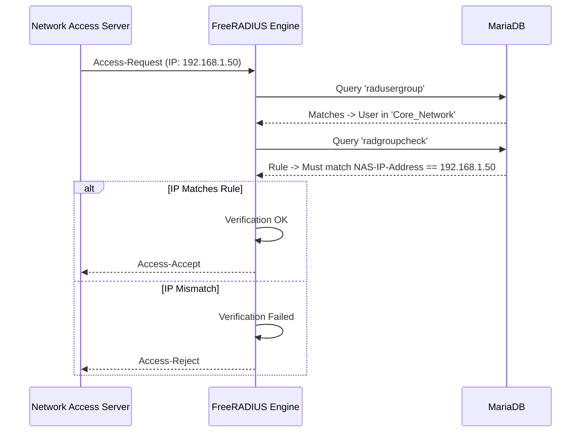

# NAS Provisioning & Huntgroups

ZeroRadius leverages **Huntgroups** and **NAS-IP-Address** anchoring to cleanly isolate what hardware profiles a user can authenticate against. This prevents a user provisioned for "Branch Office WiFi" from successfully logging into the "Core Data Center Routers".

## 1. Creating a NAS (Network Access Server)
A NAS represents any hardware device (Router, Switch, Wireless Controller) configured to ask FreeRADIUS for AAA services.

1. Navigate to the **NAS Devices** module in ZeroRadius.
2. Provide the **IP Address** and the **RADIUS Secret**.
3. *Optional but recommended:* Provide a descriptive name and hardware type to categorize it in the dashboard.

## 2. Using Huntgroups for Regional Segmentation
In FreeRADIUS, a Huntgroup allows you to bundle several NAS devices under a single localized umbrella. With ZeroRadius, we define this dynamically using the `radgroupcheck` tables.

### Architecture Flow

### Steps to Segment a User
By creating a policy directly mapping to a `NAS-IP-Address`, the backend forces an automatic rejection if the credential is used on any device failing that rule.
1. Head to **Policies & Macros**.
2. Select your Target Group.
3. Add a check condition: `NAS-IP-Address == <Your NAS IP>`.
