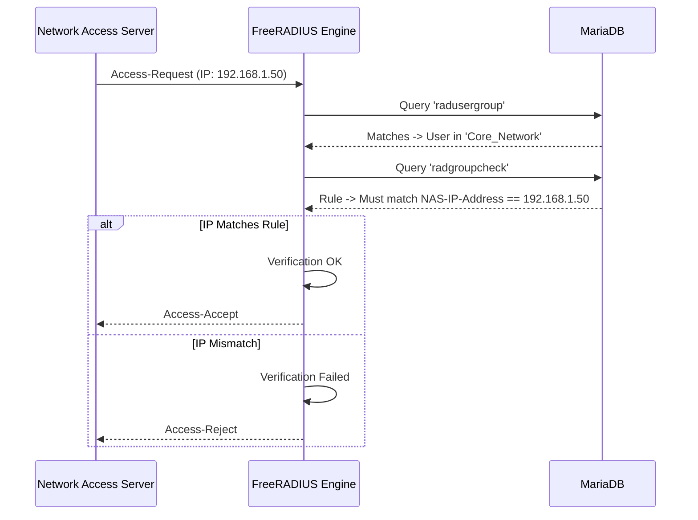

# NAS Provisioning & Huntgroups

> **Status:** Refreshed for v1.3.0. Endpoint of record is `/nas` and
> `/nas-categories`. For the AI-agent runnable version see
> [`docs/modules/nas-categories.md`](modules/nas-categories.md) and the
> deployment examples in [`docs/simulation/01-basic-access-request.md`](simulation/01-basic-access-request.md)
> (Phase 3 — placeholder).

ZeroRadius leverages **Huntgroups** and **NAS-IP-Address** anchoring to cleanly
isolate what hardware profiles a user can authenticate against. This prevents a
user provisioned for "Branch Office WiFi" from successfully logging into the
"Core Data Center Routers".

## 1. Creating a NAS (Network Access Server)

A NAS represents any hardware device (Router, Switch, Wireless Controller)
configured to ask FreeRADIUS for AAA services.

1. Navigate to the **NAS Devices** module in ZeroRadius (`/nas` in the UI).
2. Provide the **IP Address** (IPv4 or CIDR), **RADIUS Secret**, and
   optionally **shortname** / **description**.
3. *Optional:* assign a **NAS Category** (Core Routers, WiFi Controllers,
   Branch Switches) for bulk operations and privilege mapping. See
   [`docs/modules/nas-categories.md`](modules/nas-categories.md).
4. *(v1.3.0+)* The `validate_nasname` validator rejects hostnames; only IPs
   and CIDRs are accepted. This is part of the **nas-category-policy-hardening**
   change.

### Hostname rejection rationale

Allowing `nasname = "my-switch.local"` produces ambiguous RADIUS sources
(`NAS-IP-Address` is the principal anchor for Access Policies). If you
absolutely need a logical name, register the **shortname** in the dictionary
field and let the IP do the work.

## 2. Using Huntgroups for Regional Segmentation

In FreeRADIUS, a Huntgroup allows you to bundle several NAS devices under a
single localized umbrella. ZeroRadius expresses this using the `radgroupcheck`
tables — there is no need to manually edit FreeRADIUS huntgroup files.

### Architecture Flow

```mermaid
sequenceDiagram
    participant NAS as Network Access Server
    participant AAA as FreeRADIUS Engine
    participant DB as MariaDB

    NAS->>AAA: Access-Request (IP: 192.168.1.50)

    AAA->>DB: Query 'radusergroup'
    DB-->>AAA: Matches -> User in 'Core_Network'

    AAA->>DB: Query 'radgroupcheck'
    DB-->>AAA: Rule -> Must match NAS-IP-Address == 192.168.1.50

    alt IP Matches Rule
        AAA->>AAA: Verification OK
        AAA-->>NAS: Access-Accept
    else IP Mismatch
        AAA->>AAA: Verification Failed
        AAA-->>NAS: Access-Reject
    end
```

### Steps to Segment a User

By creating a policy that maps to a `NAS-IP-Address`, the backend forces an
automatic rejection if the credential is used on any device failing the rule.

1. Head to **Access Policies** (`/access-policies`).
2. Select your Target Group.
3. Add a check condition: `NAS-IP-Address == <Your NAS IP>`.
4. *(or)* Use **network segments** for CIDR-wide targeting.

For the full targeting + precedence chain, see
[`docs/modules/access-policies.md`](modules/access-policies.md#4-precedence--priority--fallback-chain).

> **Enforcement semantics (closes
> [issue #92](https://github.com/alexandervazquez98/ZeroRadius/issues/92)):**
> A `radgroupcheck` row whose `NAS-IP-Address` value does not match the
> incoming request MUST cause `Access-Reject`. The enforcement is
> performed by the explicit unlang policy at
> [`radius/policy.d/nas_huntgroup_enforcement`](../radius/policy.d/nas_huntgroup_enforcement),
> wired into the `authorize` section of
> [`radius/default.conf`](../radius/default.conf) after the second `-sql`
> pass. The policy is independent of `rlm_sql` because `rlm_sql` only
> loads check items with `==` semantics — it does not return `fail` on a
> mismatch. The distinct `Reply-Message`
> `"Huntgroup check failed: NAS-IP-Address does not match group rule"`
> distinguishes the reject path in FreeRADIUS debug logs from the
> `nas_based_authorization` reject (which uses
> `"Access denied: NAS not authorized for this user"`).

## 3. Cross-references

- **API:** [`/nas` and `/nas-categories`](api-reference.md)
- **NAS Categories module:** [`docs/modules/nas-categories.md`](modules/nas-categories.md)
- **Access Policies module:** [`docs/modules/access-policies.md`](modules/access-policies.md)
- **JIT Break-Glass (per-NAS):** [`docs/03-jit-break-glass.md`](03-jit-break-glass.md)
- **Live log viewer (post-auth trail):** [`docs/04-live-log-viewer.md`](04-live-log-viewer.md)
