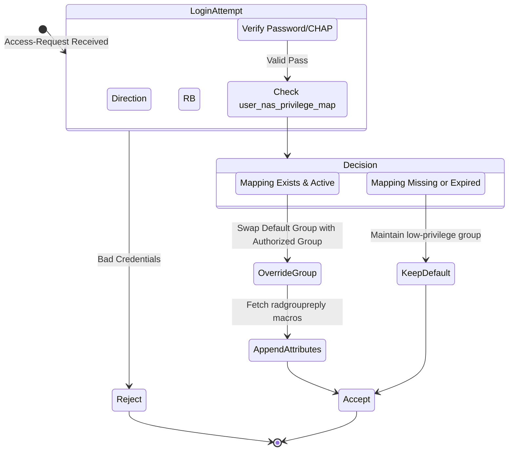

# ISO 27001 Privilege Map & RBAC

ZeroRadius implements a Zero-Trust network approach mapped to **ISO/IEC 27001 controls A.5.15 and A.8.3**. Global administrator accounts on network devices represent a significant vulnerability. We solve this by introducing dynamical NAS-Based Authorization.

## The Problem with Traditional RADIUS
Normally, an admin is placed in a "SuperAdmin" group and given global access to every switch. If their credentials leak, the entire infrastructure is compromised.

## The ZeroRadius Solution
Users are assigned a low-privilege *Default Group*. When they log into a specific hardware node, a policy intercepts the request, maps the User + NAS IP, and temporarily overrides their group with the necessary privileged attributes ONLY for that session.

### State Diagram of Privilege Evaluation

## Admin Auditing
Every mapping requires an explicit `Approved By`, a `Justification`, and a `Review Date`, meaning abandoned or stale network privileges can be systematically audited and disabled as per ISO 27001 A.8.2.

## Category-Based Targeting
In addition to IP-based targeting, ZeroRadius supports **category-based privilege mapping**. Instead of mapping a user to a specific NAS IP address, you can map them to an entire **NAS Category** (e.g., "Core Routers", "WiFi Controllers").

### Benefits
- **Scalability:** Add new devices to a category and automatically inherit privilege mappings.
- **Simplified Management:** Update permissions for all devices in a category by modifying a single mapping.
- **Bulk Operations:** Assign privileges to groups of similar hardware at once.

### How It Works
1. Create NAS Categories in the NAS Devices module (e.g., "Branch Offices", "Data Center")
2. Assign NAS devices to their corresponding categories
3. In the Privilege Map, select category-based targeting instead of IP-based
4. The backend evaluates both IP-based and category-based mappings during authentication

### Priority
When evaluating access, IP-based mappings take precedence over category-based mappings, allowing for exceptions while maintaining default category policies.
