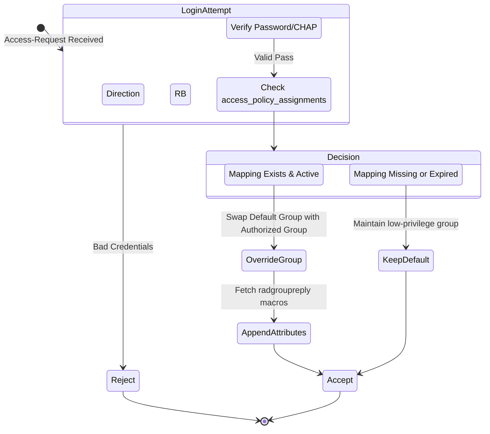

# ISO 27001 Privilege Map & RBAC

> **Status:** Historical reference. The Privilege Map concept was unified
> into the **Access Policies** module in v1.3.0 (PR #59). The canonical,
> up-to-date documentation is [`docs/modules/access-policies.md`](modules/access-policies.md).
> This document is retained because:
> 1. It still maps to ISO 27001 controls A.5.15 and A.8.3.
> 2. The state-diagram is a useful introduction to the runtime.

ZeroRadius implements a Zero-Trust network approach mapped to **ISO/IEC 27001
controls A.5.15 (Access Control)** and **A.8.3 (Information Access
Restriction)**. Global administrator accounts on network devices represent a
significant vulnerability. We solve this by introducing dynamic NAS-Based
Authorization.

## The Problem with Traditional RADIUS

Normally, an admin is placed in a "SuperAdmin" group and given global access
to every switch. If their credentials leak, the entire infrastructure is
compromised.

## The ZeroRadius Solution

Users are assigned a low-privilege *Default Group*. When they log into a
specific hardware node, a policy intercepts the request, maps the User + NAS
IP, and temporarily overrides their group with the necessary privileged
attributes **only** for that session.

### State Diagram of Privilege Evaluation

```mermaid
stateDiagram-v2
    [*] --> LoginAttempt: Access-Request Received

    state LoginAttempt {
        Direction RB
        VerifyAuth: Verify Password/CHAP
        CheckMap: Check access_policy_assignments
    }

    LoginAttempt --> Reject: Bad Credentials
    VerifyAuth --> CheckMap: Valid Pass

    state Decision {
        HasMap: Mapping Exists & Active
        NoMap: Mapping Missing or Expired
    }

    CheckMap --> Decision
    HasMap --> OverrideGroup: Swap Default Group with Authorized Group
    OverrideGroup --> AppendAttributes: Fetch radgroupreply macros
    AppendAttributes --> Accept

    NoMap --> KeepDefault: Maintain low-privilege group
    KeepDefault --> Accept

    Reject --> [*]
    Accept --> [*]
```

> **Naming note:** the diagram refers to the *historical* table
> `user_nas_privilege_map`. The current table is `access_policy_assignments`
> (renamed via Alembic migration `c0123d4`). See [`docs/database.md`](database.md#3-zeroradius-domain-tables).

## Admin Auditing

Every mapping requires an explicit `Approved By`, a `Justification`, and a
`Review Date` — meaning abandoned or stale network privileges can be
systematically audited and disabled per ISO 27001 A.8.2.

## Category-Based Targeting

In addition to IP-based targeting, Access Policies supports **category-based
privilege mapping**. Instead of mapping a user to a specific NAS IP address,
you can map them to an entire **NAS Category** (e.g., "Core Routers",
"WiFi Controllers").

### Benefits

- **Scalability:** Add new devices to a category and automatically inherit
  privilege mappings.
- **Simplified Management:** Update permissions for all devices in a
  category by modifying a single mapping.
- **Bulk Operations:** Assign privileges to groups of similar hardware at
  once.

### How It Works

1. Create NAS Categories in the NAS Devices module (e.g., "Branch Offices",
   "Data Center").
2. Assign NAS devices to their corresponding categories.
3. In Access Policies, select **category-based** targeting instead of
   IP-based.
4. The backend evaluates both IP-based and category-based mappings during
   authentication.

### Priority

> **Same precedence chain as Access Policies:** IP-based mappings take
> precedence over category-based mappings, allowing for exceptions while
> maintaining default category policies.
>
> Full chain: **exact NAS IP or range exception → segment CIDR → category
> fallback → reject**. See
> [`docs/modules/access-policies.md` § 4](modules/access-policies.md#4-precedence--priority--fallback-chain).

## 4. ISO 27001 controls mapped

| ISO 27001 control | ZeroRadius control |
|---|---|
| A.5.15 Access Control | Per-user `radius_group`; `is_active` flag |
| A.5.18 Access Rights | `nas_ip`, `nas_category_id`, `segment_id` targets |
| A.8.2 Privileged Access Rights | `Approved By` + `Justification` + `Review Date` |
| A.8.3 Information Access Restriction | Per-NAS category-based privilege isolation |

## Cross-references

- **Access Policies (current source of truth):** [`docs/modules/access-policies.md`](modules/access-policies.md)
- **NAS Categories:** [`docs/modules/nas-categories.md`](modules/nas-categories.md)
- **Network Segments:** [`docs/modules/network-segments.md`](modules/network-segments.md)
- **Audit trail:** [`docs/modules/audit.md`](modules/audit.md)
