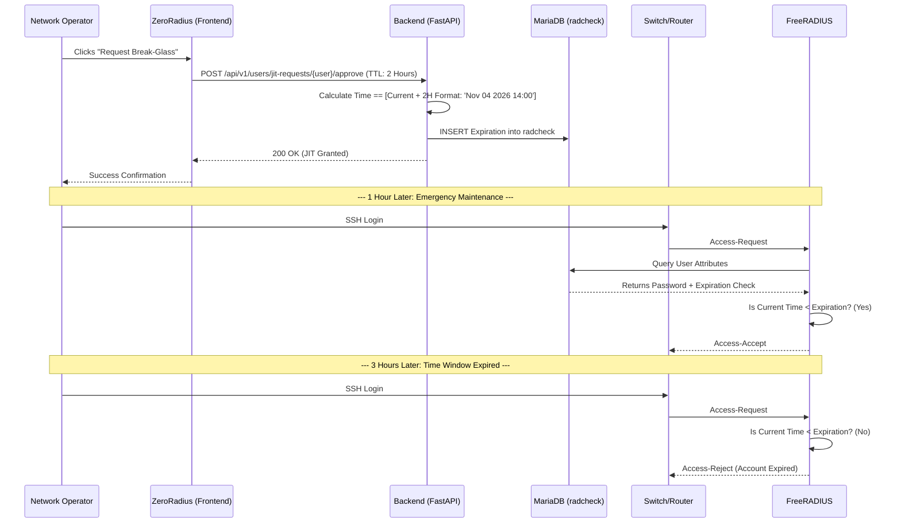

# JIT "Break-Glass" Workflow

The **Just-In-Time (JIT)** Break-Glass system grants temporary, highly restricted emergency access or planned maintenance elevation for network operators, bypassing standard access rules for a defined time window.

## Workflow Mechanics
Instead of permanently modifying groups or creating static backdoor users, ZeroRadius uses the native RADIUS `Expiration` attribute constraint.

1. The Operator accesses the ZeroRadius frontend and requests JIT elevation via the Break-Glass interface.
2. An expiration duration (e.g., 2 Hours) is authorized.
3. ZeroRadius computes the exact End Time.
4. An `Expiration` attribute is injected strictly into the `radcheck` table.
5. When the time expires, FreeRADIUS natively and gracefully rejects all further login attempts for that specific role, ensuring forgotten access grants never linger.

### Break-Glass Sequence

