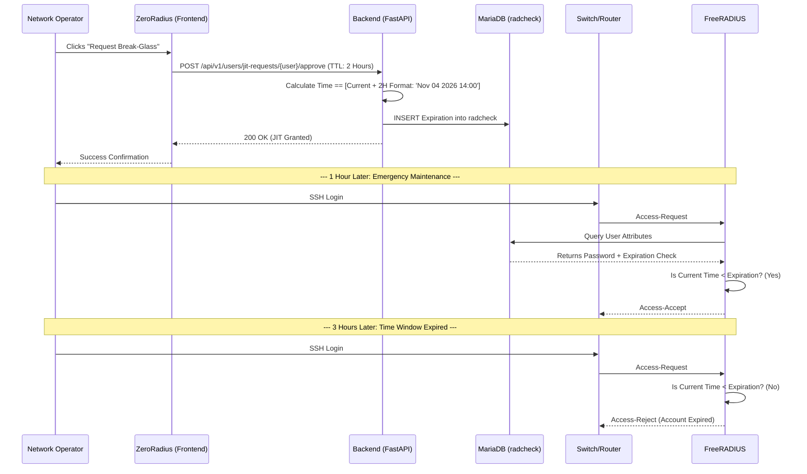

# JIT "Break-Glass" Workflow

> **Status:** Refreshed. See the agent-runnable simulation in
> [`docs/simulation/07-jit-break-glass.md`](simulation/07-jit-break-glass.md)
> *(Phase 3 — placeholder for now)*. The endpoint references are accurate.

The **Just-In-Time (JIT)** Break-Glass system grants temporary, highly
restricted emergency access or planned maintenance elevation for network
operators, bypassing standard access rules for a defined time window.

## Workflow Mechanics

Instead of permanently modifying groups or creating static backdoor users,
ZeroRadius uses the native RADIUS `Expiration` attribute constraint.

1. The Operator accesses the ZeroRadius frontend and requests JIT elevation
   via the Break-Glass interface.
2. An expiration duration (e.g., 2 hours) is authorised.
3. ZeroRadius computes the exact End Time.
4. An `Expiration` attribute is injected **strictly** into the `radcheck` table.
5. When the time expires, FreeRADIUS natively and gracefully rejects all
   further login attempts for that specific role, ensuring forgotten access
   grants never linger.

### Break-Glass Sequence

```mermaid
sequenceDiagram
    participant Oper as Network Operator
    participant ZR as ZeroRadius (Frontend)
    participant API as Backend (FastAPI)
    participant DB as MariaDB (radcheck)
    participant NAS as Switch/Router
    participant Radius as FreeRADIUS

    Oper->>ZR: Clicks "Request Break-Glass"
    ZR->>API: POST /api/v1/users/jit-requests/{user}/approve (TTL: 2 Hours)
    API->>API: Calculate Time == [Current + 2H Format: 'Nov 04 2026 14:00']
    API->>DB: INSERT Expiration into radcheck
    API-->>ZR: 200 OK (JIT Granted)
    ZR-->>Oper: Success Confirmation

    Note over Oper,Radius: --- 1 Hour Later: Emergency Maintenance ---
    Oper->>NAS: SSH Login
    NAS->>Radius: Access-Request
    Radius->>DB: Query User Attributes
    DB-->>Radius: Returns Password + Expiration Check
    Radius->>Radius: Is Current Time < Expiration? (Yes)
    Radius-->>NAS: Access-Accept

    Note over Oper,Radius: --- 3 Hours Later: Time Window Expired ---
    Oper->>NAS: SSH Login
    NAS->>Radius: Access-Request
    Radius->>Radius: Is Current Time < Expiration? (No)
    Radius-->>NAS: Access-Reject (Account Expired)
```

> **Note on the IAM removal:** the legacy "JIT request" UI lived in the
> `iam` module before commit `1ce0851 refactor: remove obsolete IAM module
> and rescue JIT access`. JIT access is now exposed under `/api/v1/users/jit-*`.
> See the historical pull request that rescued the feature.

## Operator checklist

- JIT elevation does **not** modify groups.
- The `Expiration` lives on `radcheck.username` — verify with `SELECT * FROM
  radcheck WHERE attribute='Expiration' AND username=…`.
- Revoke manually with `DELETE FROM radcheck WHERE attribute='Expiration' AND
  username=…`.
- Audit is logged under `app_audit_log` with `EventCode.ADMIN_*` matching
  the operation (granted / revoked / expired).

## Cross-references

- **Live log viewer (post-auth trail of the JIT auth):** [`docs/04-live-log-viewer.md`](04-live-log-viewer.md)
- **Access Policies module (overlap with JIT):** [`docs/modules/access-policies.md`](modules/access-policies.md)
- **Security tests for attribute lifecycle:** [`docs/security-coverage.md`](security-coverage.md)
