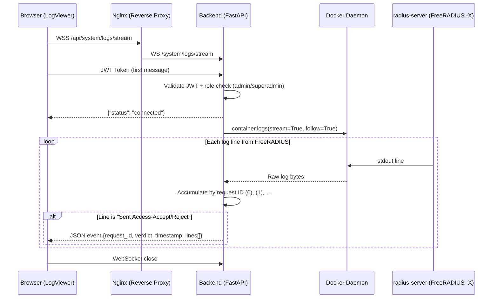

# Live RADIUS Log Viewer

ZeroRadius includes a real-time log viewer that streams FreeRADIUS Access-Request events directly to the operator's browser. This enables immediate visibility into authentication decisions without requiring SSH access to the server.

## Access

The log viewer is accessible from the **header toolbar** (next to the NTP indicator) for users with `admin` or `superadmin` roles. Click the **Logs** button to open the viewer drawer.

## Architecture



## Feature Details

### What is shown

Only **Access-Request** events are displayed — from the moment FreeRADIUS receives the request until it sends back either `Access-Accept` or `Access-Reject`. All intermediate processing lines (SQL queries, module evaluations, attribute lookups) are included in each event block for full diagnostic visibility.

### Event Format

Each event arrives as a JSON object:

```json
{
  "request_id": 0,
  "verdict": "Accept",
  "timestamp": "2026-03-30T22:44:51Z",
  "lines": [
    "(0) Received Access-Request Id 45 from 192.168.1.50:1645 to 0.0.0.0:1812",
    "(0)   User-Name = \"operator1\"",
    "(0)   NAS-IP-Address = 192.168.1.50",
    "... all processing lines ...",
    "(0) Sent Access-Accept Id 45 from 0.0.0.0:1812 to 192.168.1.50:1645"
  ]
}
```

### UI Controls

| Control | Description |
|---------|-------------|
| **Filter** | Local text search over all buffered events |
| **Pause / Resume** | Stops auto-scroll (events still accumulate in the buffer) |
| **Clear** | Empties the visual buffer |
| **Expand / Collapse** | Click any event card to expand the full log block |

### Limits

- **Buffer size**: 200 events maximum (ring buffer — oldest events are discarded when full)
- **Block size**: 500 lines maximum per request block (safety cap)
- **No persistence**: Nothing is written to disk — the stream goes directly from Docker stdout to the browser

### Color Coding

- 🟢 **Green border/badge** → `Access-Accept`
- 🔴 **Red border/badge** → `Access-Reject`

## Security

- Requires valid JWT token with `admin` or `superadmin` role
- Token is sent as the first WebSocket message (not in URL query parameters)
- Auto-reconnect with exponential backoff on connection loss
- Only the `radius-server` container logs are accessible — no other containers are exposed

## Nginx Configuration

WebSocket connections require specific proxy headers. The nginx configuration includes:

```nginx
proxy_http_version 1.1;
proxy_set_header Upgrade $http_upgrade;
proxy_set_header Connection "upgrade";
proxy_read_timeout 3600s;
proxy_send_timeout 3600s;
```

Without these headers, nginx will terminate the WebSocket handshake.
