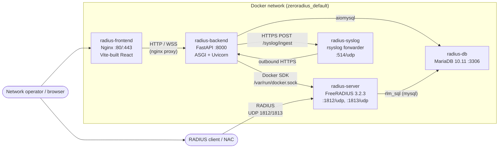
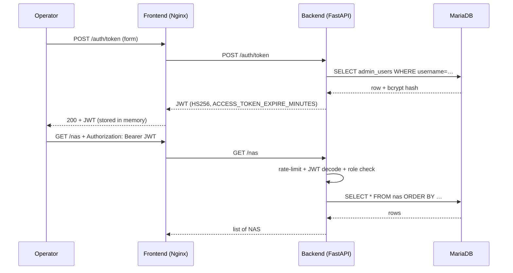
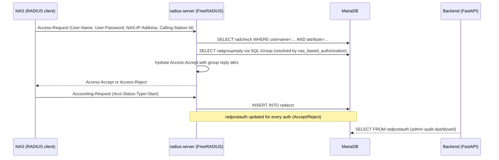
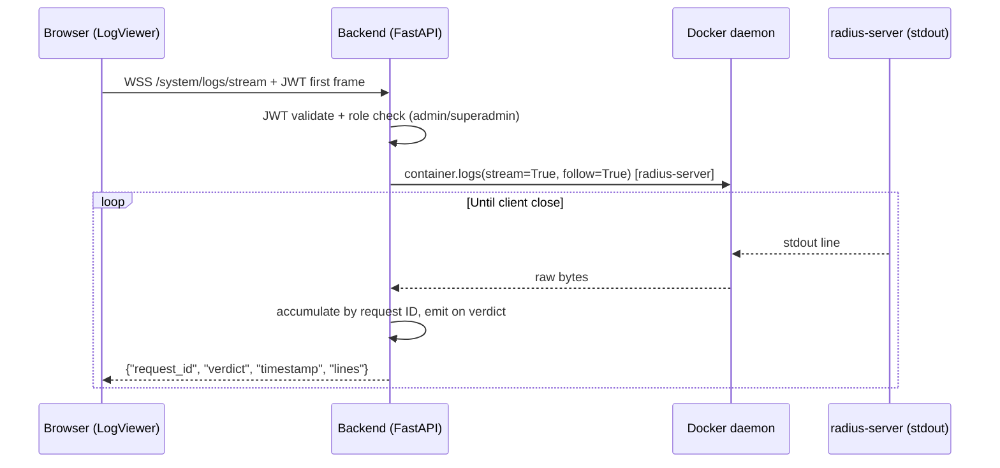

# Architecture

> **One-paragraph summary:** ZeroRadius is a five-container stack where
> FreeRADIUS performs RADIUS authentication against a MariaDB database that
> ZeroRadius (FastAPI) mutates through a structured REST + WebSocket API. A
> React frontend consumes that API and a sidecar `rsyslog` container ingests
> network-device syslog into the same database for audit.

## 1. Container topology



**Five containers:**

| Container | Image | Internal port(s) | Host port(s) | Purpose |
|---|---|---|---|---|
| `radius-frontend` | in-repo `frontend/Dockerfile` (nginx + Vite build) | 80, 443 | 3009, 443 | UI (React 19 + Tailwind) served by Nginx; reverse-proxy to backend |
| `radius-backend` | in-repo `backend/Dockerfile` | 8000 | (proxy-only) | FastAPI + SQLAlchemy 2.0 Async; rate-limited; JWT; Docker SDK access |
| `radius-db` | `mariadb:10.11` | 3306 | (none) | Standard FreeRADIUS schema extended with ZeroRadius identity tables |
| `radius-server` | `freeradius/freeradius-server:3.2.3` | 1812, 1813 | 1812/udp, 1813/udp | SQL-driven FreeRADIUS with custom `nas_based_authorization` policy |
| `radius-syslog` | in-repo `rsyslog/Dockerfile` (python:3.11-slim + requests) | 514 | 514/udp | Forwards network device syslog to backend `/syslog/ingest` |

## 2. Request flows

### 2.1 Operator login → CRUD



### 2.2 NAC → RADIUS authentication



### 2.3 RADIUS log viewer (WebSocket stream)



Backend uses `/var/run/docker.sock` mounted as a volume. This is a privileged
arrangement; see [`docs/deployment.md` → "Security implications"](deployment.md#security-implications).

### 2.4 Syslog ingestion

```
network device --UDP 514--> radius-syslog (forwarder)
                              ↓ HTTPS POST /syslog/ingest (SYSLOG_API_KEY)
                           radius-backend
                              ↓ INSERT
                           app_audit_log
```

## 3. Data model

The database schema is the union of the standard FreeRADIUS tables and the
ZeroRadius domain extensions.

### 3.1 RADIUS standard tables (provided by `database/init.sql`)

| Table | Purpose |
|---|---|
| `radcheck` | Per-user check attributes (`Cleartext-Password`, `Expiration`) |
| `radreply` | Per-user reply attributes |
| `radusergroup` | Maps users to groups (used for `SQL-Group`) |
| `radgroupcheck` | Per-group check attributes |
| `radgroupreply` | Per-group reply attributes (incl. CIR values) |
| `nas` | RADIUS clients (also extended with `category_id`) |
| `radacct` | Accounting session state |
| `radpostauth` | Post-authentication log (Accept/Reject + reply attrs) |

### 3.2 ZeroRadius domain tables (added by Alembic migrations)

| Table | Notes |
|---|---|
| `admin_users` | Local operators; roles: `superadmin`, `admin`, `auditor` |
| `login_attempts` | Per-username outcome history (drives lockout) |
| `access_policy_assignments` | Maps user → target (ip / range / segment / category) → RADIUS group; with optional `cir_id` |
| `network_segments` | Named CIDR ranges with overlap validation |
| `nas_categories` | Category definitions with `criticality` (standard / restricted / critical) |
| `circuits` | CIR (Committed Information Rate) profiles and assignments |
| `device_registry` | MAC-based device catalog with bulk CSV import; supports category-based resolution |
| `syslog_events` | Parsed syslog messages from the `radius-syslog` container |
| `app_audit_log` | Audit trail for admin actions; recorder of table_affected / row_id / user |
| `radius_reply_audit` | Per-reply audit for the access policies module |

### 3.3 SQL views

| View | Used by |
|---|---|
| `nas_cidr_ranges` | `nas_based_authorization` policy fallback; resolves NAS → category for category-based privilege resolution |

For Alembic migration history, see [`docs/database.md`](database.md#alembic-migration-history).

## 4. Process-level integration

```
┌─────────────────────────────────────────────────────────────────────────┐
│ HOST                                                                      │
│                                                                          │
│  ┌──────┐    HTTP      ┌─────────────┐   unix domain        ┌──────────┐  │
│  │ curl │ ──────────── │ radius-     │   /var/run/docker    │ radius-  │  │
│  │ or   │              │ frontend    │   .sock              │ server   │  │
│  │ brw  │              │ (nginx)     │ ───────────────────► │ (free-   │  │
│  └──────┘              └─────────────┘                      │ radius)  │  │
│       │                                                       │          │  │
│       │ UDP 1812                                             │ stdout   │  │
│       ▼                                                       ▼          │  │
│  ┌──────┐                                                ┌──────────┐  │  │
│  │ radtest│ ─────────────────────────────────────────────── │ radius-  │  │  │
│  │       │                                                │ backend  │  │  │
│  └──────┘                                                │ (logs)   │  │  │
│       │ UDP 514                                          └──────────┘  │  │
│       ▼                                                       │          │  │
│  ┌──────────┐                                                ▼          │  │
│  │ syslog   │ ──── HTTPS /syslog/ingest ─────────────────► Backend    │  │
│  │ device   │                                                │          │  │
│  └──────────┘                                                ▼          │  │
│                                                        ┌──────────┐    │  │
│                                                        │ radius-db │ ◄──┤  │
│                                                        │ (mariadb) │    │  │
│                                                        └──────────┘    │  │
└─────────────────────────────────────────────────────────────────────────┘
```

## 5. Tech stack per service

### Backend (`backend/`)
- **Framework:** FastAPI (ASGI) + Uvicorn
- **ORM:** SQLAlchemy 2.0 Async + Alembic
- **Validation:** Pydantic v2
- **Auth:** python-jose (HS256 JWT), passlib[bcrypt]
- **Rate limiting:** slowapi (Redis-less in-memory for non-cluster use)
- **Migrations:** Alembic (`backend/alembic/versions/`)
- **Tests:** pytest + httpx AsyncClient + SQLite in-memory
- **Lint:** Ruff (project uses Ruff for fastness)

### Frontend (`frontend/`)
- **Build:** Vite 5
- **Framework:** React 19
- **Styling:** Tailwind CSS 3
- **Routing:** react-router-dom v6
- **State:** React Context (Auth, Toast) — no Redux
- **HTTP client:** native `fetch` (in `api.js`)
- **Tests:** Vitest + MSW v2 + jsdom
- **Server:** Nginx (production), Vite dev server (development)

### RADIUS server (`radius/`)
- **Base image:** `freeradius/freeradius-server:3.2.3`
- **Custom policy:** `policy.d/nas_based_authorization` (Perl + unlang) implements precedence: exact IP / range exception → segment CIDR → category fallback
- **Driver:** `rlm_sql` (mysql) with mariadb client
- **Cert init:** auto-init at container start (PR #33)

### DB (`db/`)
- **Image:** `mariadb:10.11`
- **Initial schema:** `database/init.sql` + `database/migrations/*.sql`

### Syslog (`rsyslog/`)
- **Base image:** `python:3.11-slim`
- **Forwarder:** custom Python script batching 50 messages / 5 s
- **Auth:** `SYSLOG_API_KEY` sent as `X-API-Key` header

## 6. Where to look when X breaks

| Symptom | Likely component | Doc |
|---|---|---|
| Login fails | `app.services.auth_service` / `app.core.security` | [`docs/security-coverage.md`](security-coverage.md#a04-auth) |
| Access-Reject unexpected | FreeRADIUS policy `nas_based_authorization` | [`docs/modules/access-policies.md`](modules/access-policies.md) (Phase 2) |
| Live log viewer empty | Docker SDK access / radius-server not started | [`docs/04-live-log-viewer.md`](04-live-log-viewer.md) |
| Database migration out of sync | Alembic chain vs runtime schema validator | [`docs/database.md`](database.md#alembic-migration-history) |
| Syslog messages lost | Forwarder batch / `SYSLOG_API_KEY` mismatch | [`docs/deployment.md`](deployment.md) |
| Container unhealthy | Depends_on chain / healthcheck | [`docs/deployment.md`](deployment.md#troubleshooting) |

## 7. Cross-references

- **Deploy:** [`docs/deployment.md`](deployment.md)
- **Test:** [`docs/testing.md`](testing.md)
- **Database:** [`docs/database.md`](database.md)
- **Security threats:** [`docs/security-coverage.md`](security-coverage.md)
- **Quickstart (agent):** [`docs/00-agent-quickstart.md`](00-agent-quickstart.md)
