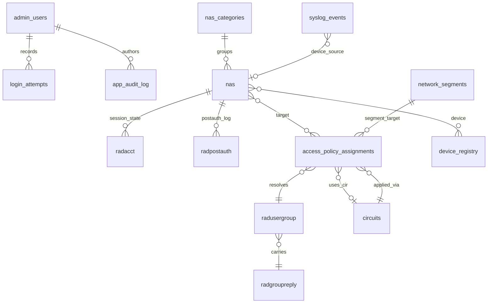

# Database

> The schema is the union of FreeRADIUS standard tables (loaded from
> `database/init.sql` on first container start) and ZeroRadius domain tables
> (managed via Alembic migrations in `backend/alembic/versions/`).

## 1. Entity overview



## 2. RADIUS standard tables (FreeRADIUS)

Loaded from `database/init.sql` at MariaDB init time. Do not edit by hand;
migrate via Alembic if extensions are needed.

| Table | Purpose | Key columns |
|---|---|---|
| `radcheck` | Per-user check attributes (passwords, expirations) | `id`, `username`, `attribute`, `op`, `value` |
| `radreply` | Per-user reply attributes | `id`, `username`, `attribute`, `op`, `value` |
| `radusergroup` | Maps users to groups; consulted by FreeRADIUS via `SQL-Group` | `username`, `groupname`, `priority` |
| `radgroupcheck` | Per-group check attributes | `id`, `groupname`, `attribute`, `op`, `value` |
| `radgroupreply` | Per-group reply attributes (incl. CIR values like `Cambium-Canopy-HPDLCIR`) | same shape |
| `nas` | RADIUS clients (extended with `category_id` by Alembic) | `id`, `nasname`, `shortname`, `secret`, `category_id` |
| `radacct` | Live accounting (start/interim/stop) | `acctsessionid`, `username`, `nasipaddress`, … |
| `radpostauth` | Post-auth decision log | `username`, `pass`, `reply`, `nasipaddress`, `calledstationid` |

`radpostauth` is the canonical source for the **Live Log Viewer** and
**Audit → Access** dashboard.

## 3. ZeroRadius domain tables

| Table | File | Purpose | New in |
|---|---|---|---|
| `admin_users` | `app/models/models.py` | Local operators; roles + bcrypt hash + `force_password_change` flag | v1.0 |
| `login_attempts` | `app/models/models.py` | Per-username outcome (drives lockout window) | v1.2 (phase 1 hardening) |
| `app_audit_log` | `app/models/models.py` | Audit trail for admin actions | v1.0 |
| `radius_reply_audit` | `app/models/models.py` | Per-reply audit for access policies | v1.3 (refactor) |
| `nas_categories` | `app/models/models.py` | Category definitions with `criticality` (`standard` / `restricted` / `critical`) and optional `vendor` | v1.2 |
| `network_segments` | `app/models/models.py` | Named CIDR ranges with overlap validation; supports per-segment policy targeting | v1.3 |
| `access_policy_assignments` | `app/models/models.py` | One row per (user, target, group); `target_type ∈ {nas_ip, range, segment, category}`; optional `cir_id` | v1.3 (refactor of `user_nas_privilege_map`) |
| `circuits` | `app/models/models.py` | CIR profile + assignment model; attributes `name`, `bandwidth_down`, `bandwidth_up`, `nas_ip`, `cir_id` | v1.3 (e614aec) |
| `device_registry` | `app/models/models.py` | MAC-based device catalog; supports bulk CSV import; category_id derived | v1.2 / v1.3 |
| `syslog_events` | `app/models/models.py` | Parsed syslog messages ingested by the `radius-syslog` container | v1.3 |

> **Naming note:** The historical name `user_nas_privilege_map` was renamed
> via migration `c0123d4_rename_user_nas_privilege_map.py`. Documentation
> referring to `user_nas_privilege_map` predates the rename.

## 4. SQL views

| View | Defined in | Used by |
|---|---|---|
| `nas_cidr_ranges` | `database/init.sql` | FreeRADIUS `nas_based_authorization` policy for category fallback resolution |

`nas_cidr_ranges` joins `nas` to `nas_categories` and exposes the category
attributes the FreeRADIUS policy needs to resolve a category-based target.

## 5. Alembic migration history

The migration chain lives at `backend/alembic/versions/`. The first migration
is `e160932 fix(schema): initialize alembic and sync models with deployed schema`
(originally named `8a10b43c8de4_sync_models_with_deployed_database_schema`).
The chain head is the latest migration as of the current release; use
`alembic current` inside the backend container to inspect:

```bash
docker exec radius-backend alembic current
docker exec radius-backend alembic history --verbose
```

### Migrations recorded in commit history

| Order (newest → oldest) | Commit | Migration filename | Purpose |
|---|---|---|---|
| 1 | `e0123d6` | `e0123d6_add_name_to_device_registry.py` | Add `name` column to `device_registry` for bulk CSV display |
| 2 | `d0123d5` | `d0123d5_remove_iam_module.py` | Remove obsolete IAM module tables (per `1ce0851 refactor`) |
| 3 | `c0123d4` | `c0123d4_rename_user_nas_privilege_map.py` | Rename historical table → `access_policy_assignments` |
| 4 | `b92d5e1` | `b92d5e1_integrity_math.py` | Add integrity math helpers used by the audit module |
| 5 | `a78f2c3` | `a78f2c3_privilege_map_mac.py` | MAC-based privilege map additions |
| 6 | `9879b9d` | `9879b9d_network_segments.py` | Add `network_segments` table + validation |
| 7 | `e160932` | `8a10b43c8de4_sync_models_with_deployed_database_schema.py` | Initial Alembic chain; syncs models with the deployed FreeRADIUS schema |

> If you add a migration, append it to this table in the same commit.

## 6. Auto-migration at startup

Since v1.3.0 (commit `1c611e9`, PR #62), the backend runs:
- **Alembic `upgrade head`** on startup (idempotent).
- **Runtime schema validator** that compares SQLAlchemy model definitions to
  the live database and refuses to start on irrecoverable drift.

This means a new schema change can land by:
1. Adding the migration file.
2. Updating the SQLAlchemy model.
3. Rebuilding the backend image.

The container will then apply the migration and start.

## 7. Seeding

| What | Where | When |
|---|---|---|
| RADIUS base tables + ZeroRadius domain tables | `database/init.sql` | First `docker compose up` only (volume created) |
| `nas_categories` initial set | Seed script `backend/scripts/seed_*.py` | Manual, agent-scriptable |
| First superadmin | `python -m scripts.seed_admin` | One-time per fresh volume |
| Authorization matrix baseline | `radius-tests/fixtures/seed_authorization_matrix.sql` | When running RADIUS tests |
| Cambium proxy baseline | `seed_cambium_proxy_baseline.sql` (root) | When running `test_radius_mac_priority.py` |

## 8. Common queries

```sql
-- List NAS by category
SELECT n.id, n.nasname, n.shortname, c.name AS category, c.criticality
FROM nas n LEFT JOIN nas_categories c ON c.id = n.category_id
ORDER BY c.criticality DESC, n.nasname;

-- Recent Access-Accept decisions
SELECT created_at, username, reply, nasipaddress, calledstationid
FROM radpostauth
WHERE reply = 'Access-Accept'
ORDER BY created_at DESC
LIMIT 50;

-- Access policy with current SQL-Group target
SELECT u.username, a.target_type, a.target_value, g.groupname
FROM access_policy_assignments a
JOIN radusergroup u ON u.username = a.username
JOIN radgroupreply g ON g.groupname = u.groupname
WHERE a.active = 1
ORDER BY a.priority DESC, a.id;

-- CIR resolution preview for a target NAS IP
SELECT a.id, a.username, a.target_value, c.name AS circuit_name,
       c.bandwidth_down, c.bandwidth_up
FROM access_policy_assignments a
LEFT JOIN circuits c ON c.id = a.cir_id
WHERE a.active = 1
  AND (a.target_type = 'nas_ip' AND a.target_value = '192.168.10.50'
       OR a.target_type = 'category'
          AND a.target_value IN (SELECT name FROM nas_categories nc
                                  JOIN nas n ON n.category_id = nc.id
                                  WHERE n.nasname = '192.168.10.50'))
ORDER BY a.priority DESC;
```

## 9. Where to look next

- **Architecture / data flow:** [`docs/architecture.md` → §3 data model](architecture.md#3-data-model)
- **API endpoints that mutate these tables:** [`docs/api-reference.md`](api-reference.md) *(Phase 2)*
- **Security / SQL injection mitigations:** [`docs/security-coverage.md`](security-coverage.md#a01-injection)
- **Access policy resolution algorithm:** [`docs/modules/access-policies.md`](modules/access-policies.md) *(Phase 2)*
